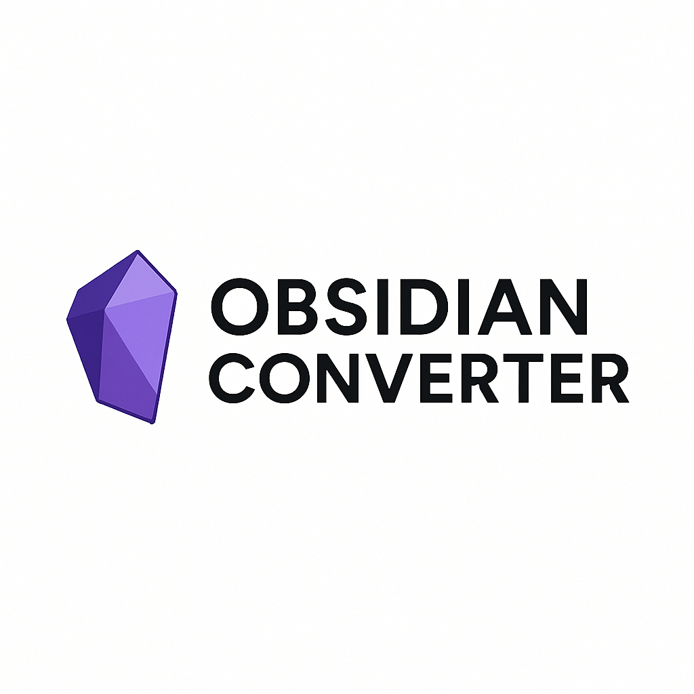

<p align="center">
  
</p>

<h1 align="center">ObsidianConverter</h1>

<p align="center">
  Düz metin dosyalarını akıllı bağlantı, etiketleme ve düzenleme özellikleriyle yapılandırılmış Obsidian notlarına dönüştüren güçlü bir araç.
</p>

<p align="center">
  <a href="README.md">🇬🇧 English</a> |
  <a href="README_TR.md">🇹🇷 Türkçe</a> |
  <a href="README_ES.md">🇪🇸 Español</a> |
  <a href="README_DE.md">🇩🇪 Deutsch</a> |
  <a href="README_FR.md">🇫🇷 Français</a> |
  <a href="README_ZH.md">🇨🇳 中文</a>
</p>

## Özellikler

- **Akıllı İçerik Ayrıştırma**: Doğal içerik sınırlarını belirlemek ve bilgileri düzenlemek için LLM'leri kullanır
- **Otomatik Not Bağlantıları**: Anlamsal benzerlik kullanarak notlar arasında bağlantılar oluşturur
- **Özyinelemeli Dizin İşleme**: Bir dizin ve alt dizinlerindeki tüm metin dosyalarını işler
- **Obsidian Optimizasyonu**: Obsidian için uygun ön madde ve biçimlendirmeyle dosyalar oluşturur
- **Akıllı Etiket Oluşturma**: Not içeriğine göre ilgili etiketler önerir
- **İçerik Kategorileme**: Notları içerik temalarına göre mantıksal klasörlerde düzenler
- **Gelişmiş Obsidian Entegrasyonu**: Callout'lar, dataview sorguları ve içindekiler tablosu desteği
- **Paralel İşleme**: Daha hızlı dönüşüm için birden fazla dosyayı aynı anda işler
- **Yapılandırma Sistemi**: YAML yapılandırma dosyalarıyla davranışı özelleştirme
- **İstatistik Takibi**: Dönüşüm süreci ve not oluşturma hakkında ayrıntılı istatistikler
- **Çoklu LLM Desteği**: Ollama, OpenAI veya Anthropic modelleriyle çalışır
- **Etkileşimli Mod**: Notları kaydetmeden önce gözden geçirin, düzenleyin ve iyileştirin
- **Docker Desteği**: Kolay kurulum için Docker ve Docker Compose ile çalıştırma

## Gereksinimler

- Python 3.8+
- Aşağıdaki LLM sağlayıcılarından biri:
  - [Ollama](https://ollama.ai/) (varsayılan, yerel LLM hizmeti)
  - OpenAI API anahtarı (GPT modelleri için)
  - Anthropic API anahtarı (Claude modelleri için)
- Gerekli Python paketleri (bkz. `requirements.txt`)
- Docker (isteğe bağlı, konteynerleştirilmiş kullanım için)

## Kurulum

### Yöntem 1: Geliştirici Kurulumu
1. Bu depoyu klonlayın
2. Sanal ortam oluşturun: `python -m venv venv`
3. Ortamı etkinleştirin:
   - macOS/Linux'ta: `source venv/bin/activate`
   - Windows'ta: `venv\Scripts\activate`
4. Geliştirme modunda kurun: `pip install -e .`

### Yöntem 2: Normal Kurulum
1. Bu depoyu klonlayın
2. Şunu çalıştırın: `pip install .`

### Yöntem 3: Docker Kurulumu
1. Docker imajını oluşturun: `docker build -t obsidian-converter .`
2. Docker ile çalıştırın: `docker run -v $(pwd)/txt:/data/input -v $(pwd)/vault:/data/output obsidian-converter`
3. Veya Docker Compose kullanın: `docker-compose up`

Ayrıntılı Docker talimatları için [README_DOCKER.md](README_DOCKER.md) dosyasına bakın.

### Önkoşullar
- Ollama için: Gereken modelle birlikte kurulup çalıştığından emin olun (varsayılan: "mistral")
  - Modeli şu komutla yükleyin: `ollama pull mistral`
- OpenAI için: API anahtarınızı `--openai-key` argümanı veya `OPENAI_API_KEY` ortam değişkeni ile ayarlayın
- Anthropic için: API anahtarınızı `--anthropic-key` argümanı veya `ANTHROPIC_API_KEY` ortam değişkeni ile ayarlayın

## Kullanım

```bash
# Yardım mesajını göster
obsidian-converter --help

# Temel kullanım (txt/ dizinindeki tüm .txt dosyalarını işler)
obsidian-converter

# Belirli dosyaları işle
obsidian-converter files example.txt subdir/notes.txt

# Çıktı dizinini temizle
obsidian-converter clean

# Oluşturulan tüm notları listele
obsidian-converter list

# Belirli bir kategorideki notları listele
obsidian-converter list --category technical

# Yapılandırma dosyası oluştur
obsidian-converter config --create --file my_config.yaml

# Mevcut yapılandırmayı görüntüle
obsidian-converter config --file my_config.yaml

# Yapılandırma dosyası kullan
obsidian-converter --config my_config.yaml

# Özel dizinler
obsidian-converter --input /path/to/input --output /path/to/output

# Paralel işlemeyi etkinleştir
obsidian-converter --parallel --workers 4

# Dönüştürmeden önce çıktı dizinini temizle
obsidian-converter --clean

# Belirli bir model kullan
obsidian-converter --model llama2

# Ayrıntılı günlükleme
obsidian-converter --verbose

# Etkileşimli inceleme modu
obsidian-converter --interactive

# Etkileşimli mod için düzenleyici belirt
obsidian-converter --interactive --editor vim

# Farklı LLM sağlayıcıları kullan
obsidian-converter --provider ollama --model llama2
obsidian-converter --provider openai --model gpt-3.5-turbo --openai-key API_ANAHTARINIZ
obsidian-converter --provider anthropic --model claude-3-sonnet-20240229 --anthropic-key API_ANAHTARINIZ

# Tüm seçenekler birlikte
obsidian-converter --input /path/to/input --output /path/to/output --model llama2 \
  --similarity 0.4 --max-links 10 --clean --verbose --parallel --workers 8 --interactive
```

## Yapılandırma

Araç, komut satırı argümanları veya YAML yapılandırma dosyası aracılığıyla yapılandırılabilir:

```bash
# Varsayılan yapılandırma dosyası oluştur
obsidian-converter config --create --file my_config.yaml
```

Örnek yapılandırma dosyası:

```yaml
# Temel ayarlar
input_dir: txt
output_dir: vault
model: mistral

# LLM sağlayıcı ayarları
provider: ollama      # ollama, openai veya anthropic
openai_api_key: null  # OpenAI API anahtarınız (veya env değişkeni kullanın)
anthropic_api_key: null  # Anthropic API anahtarınız (veya env değişkeni kullanın)
llm_temperature: 0.7  # LLM yanıtları için sıcaklık

# İşleme ayarları
similarity_threshold: 0.3
max_links: 5
use_cache: true
cache_file: .llm_cache.json

# Performans ayarları
parallel_processing: true
max_workers: 4
chunk_size: 1000000  # Büyük dosyalar için 1MB parçalar

# Obsidian özel ayarları
obsidian_features:
  callouts: true
  dataview: true
  toc: true
  graph_metadata: true

# Dosya kalıpları dahil etme/hariç tutma
include_patterns:
  - '*.txt'
  - '*.md'
exclude_patterns:
  - '*.tmp'
  - '~*'
```

Bu yapılandırma dosyasını şöyle kullanabilirsiniz:

```bash
obsidian-converter --config my_config.yaml
```

## Gelişmiş Özellikler

### İstatistikler ve Raporlama

Araç, dönüşüm süreci hakkında şu istatistikleri oluşturur:

- İşlenen dosya ve oluşturulan not sayısı
- Kategori ve etiket dağılımı
- Kelime ve karakter sayıları
- LLM performans ölçümleri
- İşleme süresi

JSON raporu otomatik olarak çıktı klasörünüzdeki `.stats` dizinine kaydedilir.

### Paralel İşleme

Büyük belge setleri için, dönüşümü hızlandırmak üzere paralel işlemeyi etkinleştirin:

```bash
obsidian-converter --parallel --workers 4
```

### Bellek Optimizasyonu

Büyük dosyalar, bellek kullanımını azaltmak için otomatik olarak parçalar halinde işlenir. Yapılandırma dosyasında parça boyutunu özelleştirebilirsiniz.

### Özel Dosya Kalıpları

Varsayılan olarak, araç `.txt` dosyalarını işler, ancak yapılandırma dosyasında kalıpları özelleştirebilirsiniz:

```yaml
include_patterns:
  - '*.txt'  # Metin dosyaları
  - '*.md'   # Markdown dosyaları
  - 'notes_*.log'  # Belirli adlandırmaya sahip günlük dosyaları
```

### Etkileşimli Mod

Etkileşimli modda notları kaydetmeden önce gözden geçirin ve düzenleyin:

```bash
obsidian-converter --interactive
```

Etkileşimli modda şunları yapabilirsiniz:
- Notları tercih ettiğiniz metin düzenleyicide düzenleyin
- Saklamak istemediğiniz notları atın
- Not kategorilerini değiştirin
- Karar vermeden önce tam içeriği görüntüleyin
- Meta verileri ve önerilen bağlantıları gözden geçirin

Sistem varsayılanı yerine özel bir düzenleyici belirtmek için:

```bash
obsidian-converter --interactive --editor vim
```

## Örnek Çıktı

Karışık notlar içeren bir metin dosyası için ObsidianConverter, birden çok iyi yapılandırılmış markdown dosyası oluşturacaktır:

```markdown
---
title: Proje Planlaması
date: 2023-06-15
tags: [planlama, proje-yönetimi, iş-akışı]
category: Çalışma
---

## Proje Planlaması

İşte proje planlaması hakkında çıkarılan içerik...

## İlgili Notlar
- [[Toplantı Notları - Q2 İncelemesi]]
- [[Görev Önceliklendirme Yöntemleri]]
```

## Nasıl Çalışır

1. Giriş dizini ve alt dizinlerindeki tüm `.txt` dosyalarını okur
2. İçeriği mantıksal bölümlere ayırmak ve analiz etmek için LLM kullanır
3. Her not için uygun meta veriler (ön madde) oluşturur
4. İlgili notlar arasında bağlantılar kurar
5. Notları temiz bir klasör yapısında düzenler
6. Eksiksiz Obsidian vault'u oluşturur

## Lisans

MIT